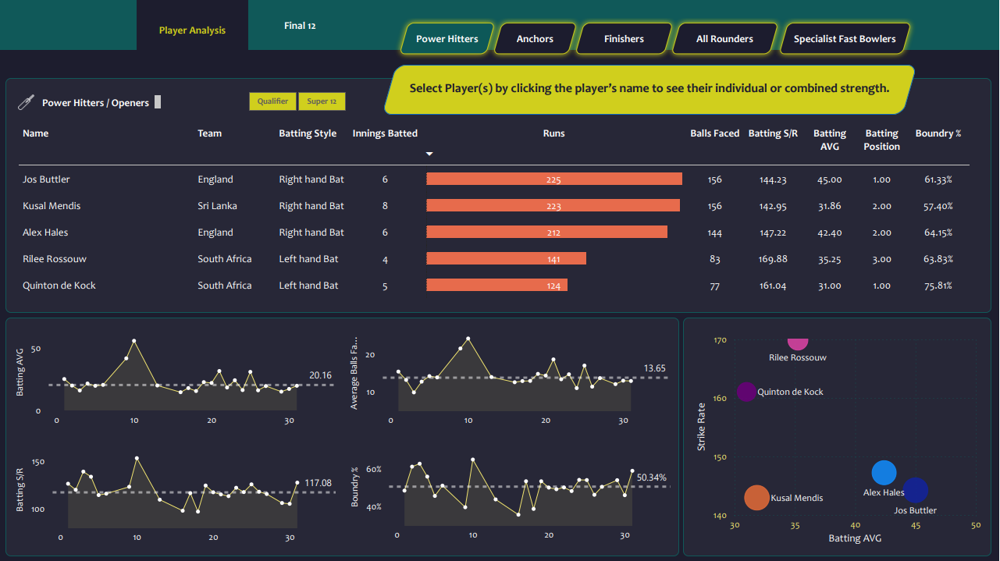

# T20-World-Cricket-Analysis

## Overview
This project focuses on analyzing the T20 World Cup 2022 data to select the best 11 players of the tournament. The analysis was conducted using Python (Pandas) for data cleaning and manipulation, and Power BI for further data processing and visualization. The goal of this project is to evaluate players' strengths and weaknesses based on their performance in the tournament.

## Key Features:
- **Data Collection:** Raw CSV data files sourced from the Codebasics YouTube channel.
- **Data Cleaning & Manipulation:**
  - Performed initial data wrangling using Python's Pandas library to clean and organize the data.
  - Imported the cleaned data into Power BI and performed further transformations in Power Query Editor.
- **Calculated Measures & Columns:**
  - Created custom measures, and calculated columns, and tables in Power BI to derive meaningful insights.
- **Dashboard:** Built an interactive dashboard in Power BI to visualize key performance metrics, such as runs scored, wickets taken, strike rate, economy rate, and fielding performance.
- **Analysis Outcome:** Used the dashboard to analyze player strengths and weaknesses, leading to the selection of the best 11 players of the tournament based on their overall contribution.
## Tools & Technologies:
  - **Python (Pandas):** Data cleaning, manipulation, and preparation.
  - **Power BI:** Data visualization, calculated measures, and dashboards.
  - **Power Query Editor:** Further data cleaning and transformation in Power BI.
## Project Objectives:
- Identify key player performance metrics to select the best 11 players.
- Evaluate players' strengths and weaknesses across various statistical categories.
- Provide recommendations based on data insights for player selection in future tournaments.

## Files:
- `reports\t20_wc_analysis_dash_board.pbix`: The Power BI Desktop file.
- `data/t20_wc_analysis_json_files`: Contains the raw data json files used for data pre-processing and preparation.
  - `t20_wc_batting_summary.json`
  - `t20_wc_bowling_summary.json`
  - `t20_wc_match_results.json`
  - `t20_wc_player_info.json`
- `data/t20_wc_analysis_csv_files`: Contains the raw and cleaned CSV files used for analysis.
  - `dim_match_summary.csv`
  - `dim_players.csv`
  - `fact_bating_summary.csv`
  - `fact_bowling_summary.csv`
- `scripts\t20_wc_data_preprocessing.ipynb`: Python scripts used for data cleaning and preparation.
- `exports`: Contains exported versions of the report.
    - `t20_wc_analysis_dash_board.pdf`
    - `t20_wc_power_hitters.png`

## Preview


## How to use

### Prerequisites
- Jupyter Notebook or application for Python (pandas)
- Power BI Desktop

### Steps:
1. Clone this repository:
  ```bash
  git clone https://github.com/purna-chandrasekhar/T20-World-Cricket-Analysis.git
